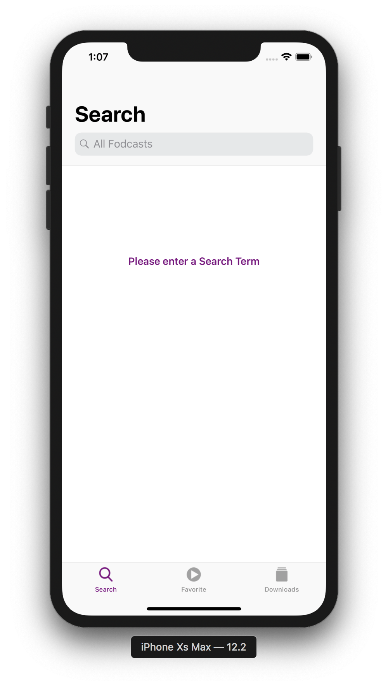
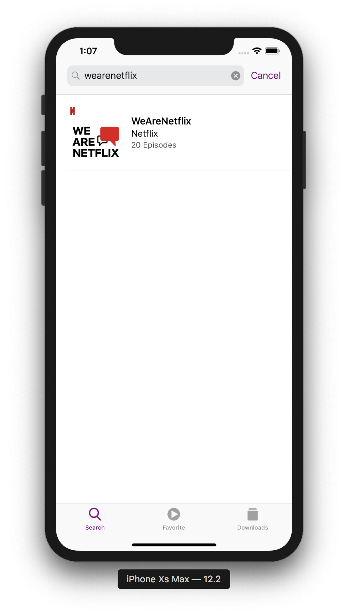
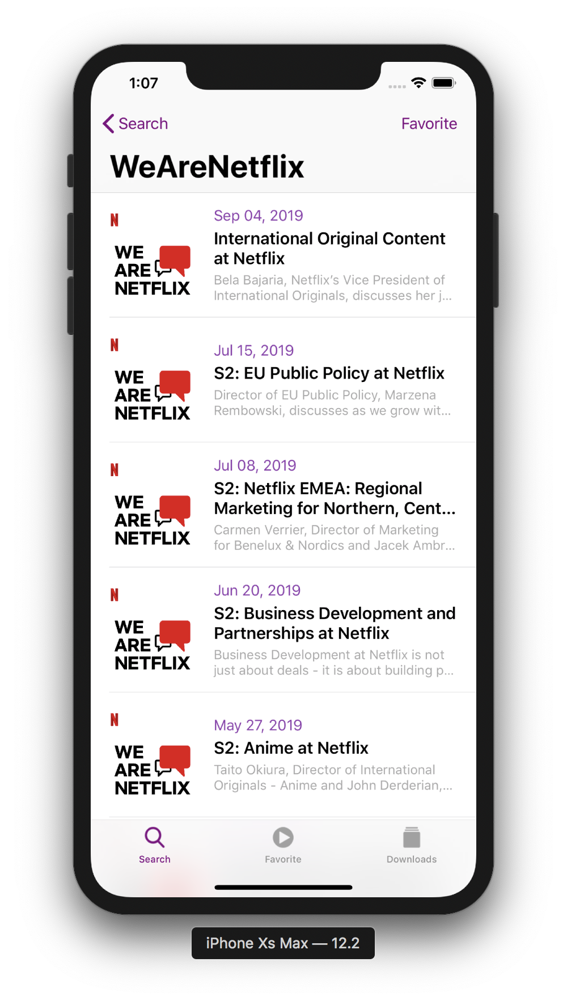
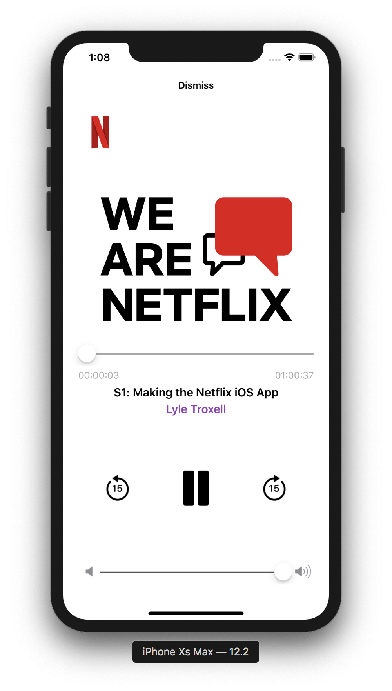
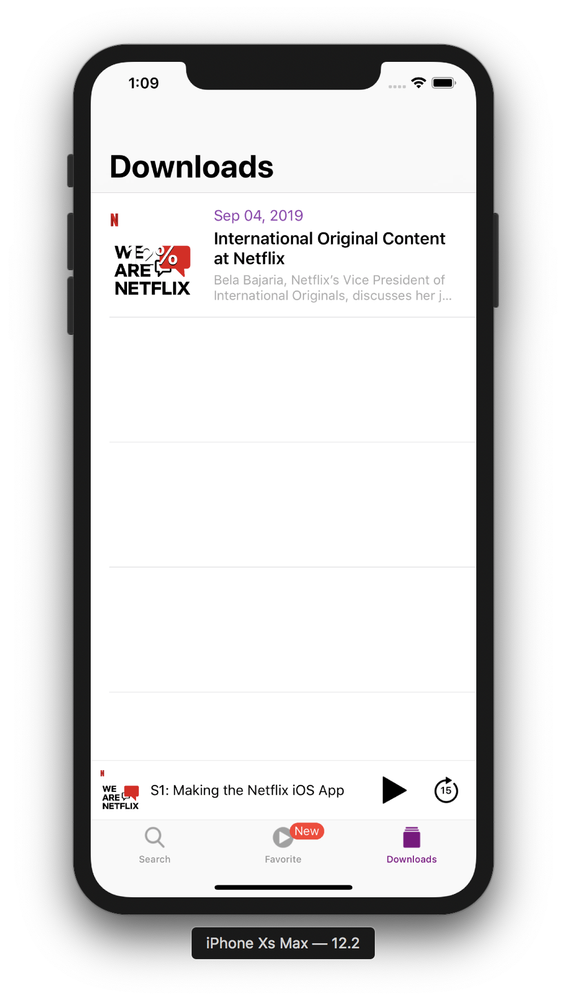
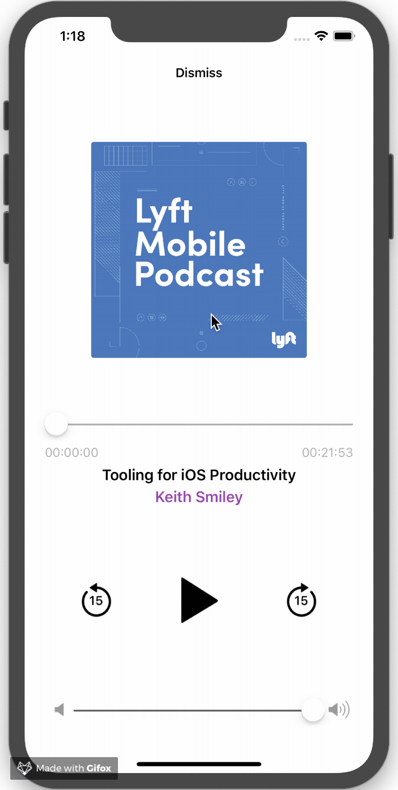

# Fodcast

My side project.

## Screenshots

## Recording

## Features

- [x] Searching for podcasts using iTunes API.
- [x] Listen, adjust volume, forward or backward 15seconds each tap.
- [x] Drag playing view to minimize or maximize.
- [x] Play/Pause, adjust volume, adjust the time in the background.
- [x] Choose podcast as your favorite
- [x] Download episodes you loved.
- [ ] Dark mode.

## Usage

1. Download `git clone https://github.com/ldakhoa/Fodcast.git`
2. Run `pod install`
